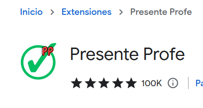
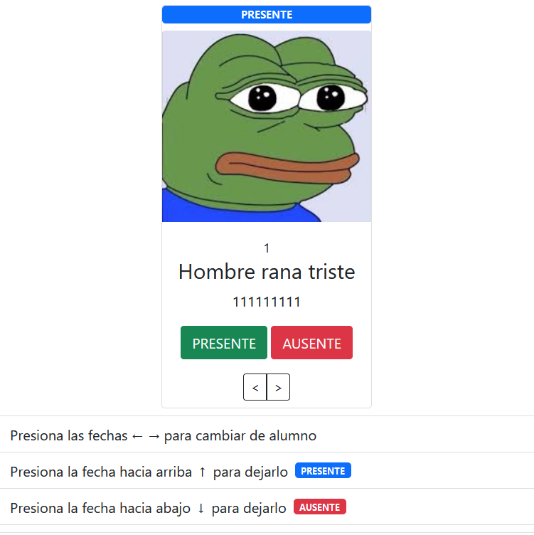

# Extensión de Chrome Presenteprofe
<a href="https://chrome.google.com/webstore/detail/presente-profe/cdlobfdkmnceddliohfkoiijnifbebgm?hl=es">Añadir extensión de chrome</a>

**Presenteprofe** es una extensión de Chrome diseñada para ayudar a los profesores a tomar la asistencia de los alumnos de manera rápida y fácil. La extensión proporciona una interfaz simple, intuitiva e interactiva para registrar la presencia o ausencia de los estudiantes en una clase.

## Características

- Fácil de instalar y usar
- Interfaz de usuario simple e intuitiva
- Registro de asistencia rápido y eficiente
- Feedback interactivo para los estudiantes

## Cómo usar

1. Instala la extensión desde la tienda web de Chrome.
2. Abre la extensión Presenteprofe desde la barra de herramientas de Chrome.
3. Selecciona la clase para la cual deseas tomar la asistencia.
4. Utiliza la interfaz de Presenteprofe para marcar a los estudiantes como presentes o ausentes.

